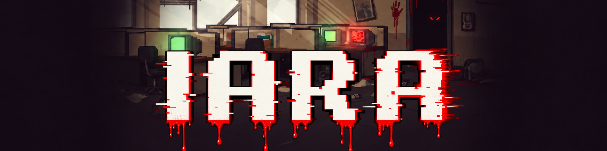
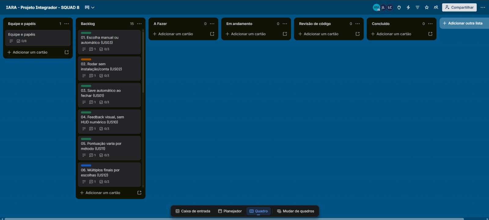
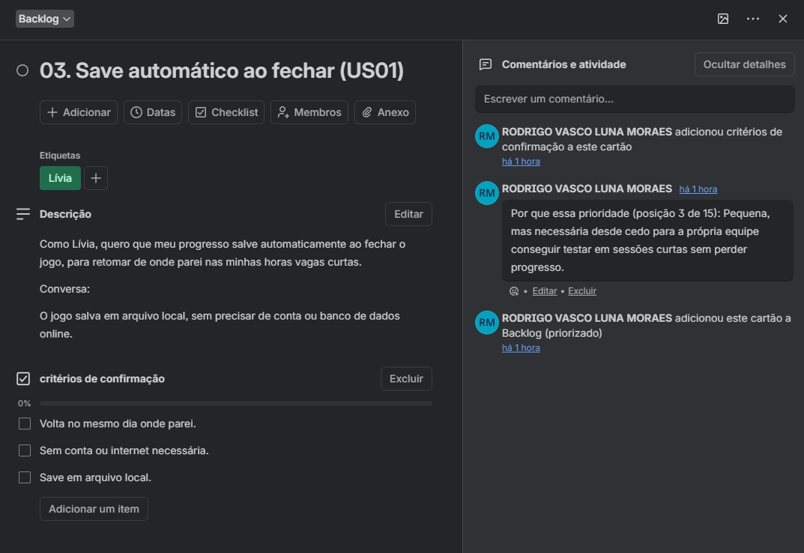
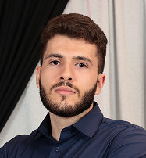
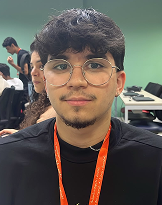
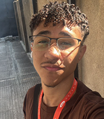

# IARA
 
Você investiga um caso de horror corporativo envolvendo IARA, uma inteligência
artificial fictícia. Quanto mais questiona as respostas dela em vez de
aceitá-las automaticamente, mais precisa recorrer à lógica para provar
as inconsistências. Assim, a mecânica ensina ao mesmo tempo ética em IA e lógica clássica.
 

  

## Ferramentas tecnológicas
 

- **Motor e gameplay:** C, para o game loop, menus, gerenciamento de estado e persistência.
- **Renderização:** [raylib](https://www.raylib.com/), biblioteca gráfica em C, 2D.
- **Regras puras:** Haskell, para os módulos de lógica, validação de respostas e seleção de conteúdo.
- **Versionamento:** GitHub, com fluxo de branches e Pull Requests descrito no [`CONTRIBUTING.md`](CONTRIBUTING.md).

## Backlog e board

 
## Squad
 
Fotos e sprites ficam em [`docs/assets/`](docs/assets/README.md).
 
| Foto | Sprite | Nome | Função | GitHub | LinkedIn | Email |
|---|---|---|---|---|---|---|
|  |  | Anderson Santos | Lógica matemática | [acampospsantos](https://github.com/acampospsantos) | [andersoncampospsantos](https://www.linkedin.com/in/andersoncampospsantos) | acps@cesar.school |
|  |  | João Pedro | Desenvolvimento das regras em Haskell | [jpsouza25](https://github.com/jpsouza25) | [joão-pedro-souza-costa](https://www.linkedin.com/in/jo%C3%A3o-pedro-souza-costa-a0456430b/) | jpsc@cesar.school |
|  |  | João Vitor Medeiros | Desenvolvimento do motor em C | [JvMedeiros7](https://github.com/JvMedeiros7) | [jvmedeiros7](https://www.linkedin.com/in/jvmedeiros7/) | jvm7@cesar.school |
|  |  | Julio Cesar Lins | Desenvolvimento do motor em C | [Lins-ju](https://github.com/Lins-ju) | [júlio-lins](https://www.linkedin.com/in/j%C3%BAlio-lins-123905182/) | jcsl@cesar.school |
|  |  | Laura Brayner | Design e integração | [laurabrayner](https://github.com/laurabrayner) | [laurabrayner](https://www.linkedin.com/in/laurabrayner) | lcbc@cesar.school |
|  |  | Luan Arruda | Design e integração | [luan-arruda](https://github.com/luan-arruda) | [luan-arruda-548a9534b](https://www.linkedin.com/in/luan-arruda-548a9534b) | las9@cesar.school |
|  |  | Nicolas Mauricio | Gestão ágil | [nicollasfr](https://github.com/nicollasfr) | [nicollasmfranca](https://www.linkedin.com/in/nicollasmfranca/) | nmcf@cesar.school |
|  |  | Rodrigo Vasco | Engenharia de software | [ByRodrigoVasco](https://github.com/ByRodrigoVasco) | [rodrigo-vlm](https://www.linkedin.com/in/rodrigo-vlm/) | rvlm@cesar.school |
