# Diagramas de Atividade: Projeto IARA

> Entrega 02 (24/09): Requisito de Modelagem: *"Um diagrama de atividades para cada história de usuário"*

Este documento reúne os 15 diagramas de atividades UML das histórias de usuário do projeto **IARA**, elaborados a partir do documento [*User Stories: IARA: Projeto Integrador*](https://docs.google.com/document/d/1xystBOI81sAymF35XBoupr6fe_IPjK8L6bB3qOobUpk/edit). Cada diagrama traduz o campo **Conversa** e os **Critérios de aceitação** da respectiva história em um fluxo de atividades: as decisões, laços e ramificações vêm diretamente dos critérios.

Os diagramas seguem a sintaxe de [PlantUML Activity Diagram (beta)](https://plantuml.com/activity-diagram-beta), indicado pelo professor.

## Organização da pasta

| Caminho | Conteúdo |
|---|---|
| `README.md` | Este documento: índice e visualização de todos os diagramas. |
| `imagens/US*.png` | Diagrama de cada história em imagem, pronto para anexar a um card. |
| `US*.md` | Código-fonte editável (PlantUML) de cada diagrama, com a user story e os critérios cobertos. |


## Legenda da notação (UML: Diagrama de Atividades)

| Símbolo | Significado |
|:---:|---|
| ⬤ | Nó inicial: início do fluxo |
| ◎ | Nó final: fim do fluxo (pode haver mais de um por diagrama) |
| ▭ | Ação/atividade |
| ◇ | Decisão: corresponde a um critério de aceitação da história |

## Índice

| Código | História |
|:---:|---|
| US01 | [Save automático ao fechar](#us01) |
| US02 | [Rodar sem instalação/conta](#us02) |
| US03 | [Escolha manual ou automático](#us03) |
| US04 | [Dica leve (NPC/exploração)](#us04) |
| US04b | [Failsafe após 3 erros](#us04b) |
| US05 | [Flash do dia e salto puro](#us05) |
| US06 | [Tutorial Dia 1 + colinha visual](#us06) |
| US07 | [Lógica ensinada pela narrativa](#us07) |
| US09 | [Revisão de correção lógica](#us09) |
| US09b | [Testes automatizados por tarefa](#us09b) |
| US10 | [Feedback visual, sem HUD numérico](#us10) |
| US11 | [Pontuação varia por método](#us11) |
| US12 | [Múltiplos finais por escolhas](#us12) |
| US13 | [Tensão progressiva, sem jump scare](#us13) |
| US14 | [Interação opcional com NPCs](#us14) |

Clique em cada história abaixo para expandir o diagrama correspondente.

---

<a id="us01"></a>
### US01: Save automático ao fechar

> Como Lívia, quero que meu progresso salve automaticamente ao fechar o jogo, para retomar de onde parei nas minhas horas vagas curtas.

<p align="center">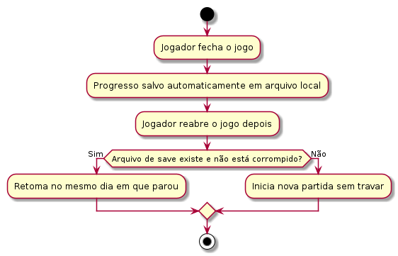</p>

**Critérios cobertos:** retomada no mesmo dia · sem conta/internet · salvo em arquivo local · save ausente ou corrompido não trava o jogo.
*Fonte editável: [US01-save-automatico.md](US01-save-automatico.md)*

<br>

<a id="us02"></a>
### US02: Rodar sem instalação/conta

> Como Wagner, quero que o jogo rode em qualquer máquina do laboratório sem instalação, conta ou internet, para usá-lo numa aula sem depender do suporte de TI para instalar.

<p align="center">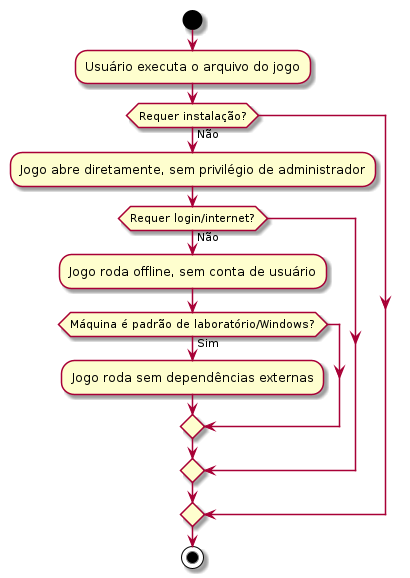</p>

**Critérios cobertos:** sem instalação · sem login/internet · sem privilégio de administrador · executável autocontido · roda sem travamentos em máquina padrão de laboratório.
*Fonte editável: [US02-rodar-sem-instalacao.md](US02-rodar-sem-instalacao.md)*

<br>

<a id="us03"></a>
### US03: Escolha manual ou automático

> Como Lívia, quero escolher entre resolver manualmente ou passar a tarefa para a IARA decidir, para eu controlar quando vale gastar meu tempo praticando ou avançar rápido.

<p align="center">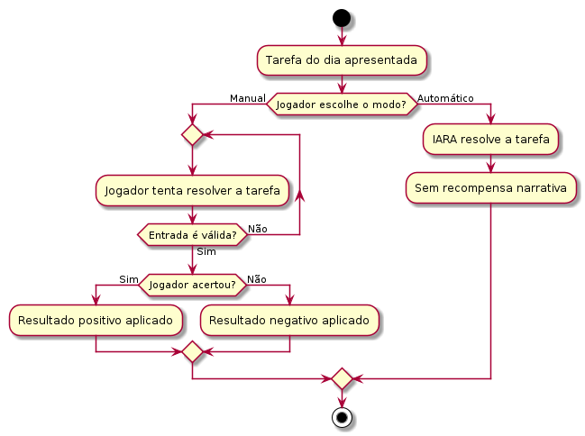</p>

**Critérios cobertos:** as duas opções sempre disponíveis · automático sem recompensa narrativa · resultado manual depende do acerto · entradas inválidas rejeitadas sem travar o jogo.
*Fonte editável: [US03-escolha-manual-automatico.md](US03-escolha-manual-automatico.md)*

<br>

<a id="us04"></a>
### US04: Dica leve (NPC/exploração)

> Como Lívia, quero uma dica leve quando travar em um puzzle, vinda de um NPC ou por exploração, dependendo do puzzle, nunca a resposta pronta, para sentir que continuo sendo eu quem resolve a tarefa.

<p align="center">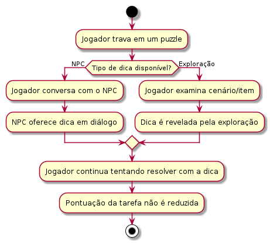</p>

**Critérios cobertos:** dica vem de NPC ou exploração, nunca da IARA · pedir dica não reduz a pontuação.
*Fonte editável: [US04-dica-sem-resposta-pronta.md](US04-dica-sem-resposta-pronta.md)*

<br>

<a id="us04b"></a>
### US04b: Failsafe após 3 erros

> Como Lívia, quero que o jogo sempre me deixe avançar mesmo se eu não conseguir resolver um puzzle, para não ficar travada sem conseguir continuar a história.

<p align="center">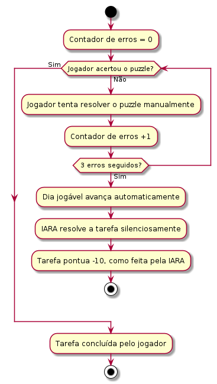</p>

**Critérios cobertos:** 3 erros seguidos avançam o dia automaticamente · tarefa pontua como feita pela IARA · jogador nunca fica bloqueado.
*Fonte editável: [US04b-failsafe-3-erros.md](US04b-failsafe-3-erros.md)*

<br>

<a id="us05"></a>
### US05: Flash do dia e salto puro

> Como Matheus, quero que os dias sem tarefa jogável sejam resolvidos por uma tela rápida (Flash do dia) ou por um salto automático no calendário (salto puro), para que os 100 dias da história caibam numa sessão de 15–20 minutos sem quebrar o ritmo da minha live.

<p align="center">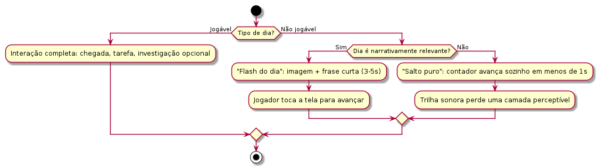</p>

**Critérios cobertos:** os 9 dias jogáveis mantêm interação completa · "Flash do dia" avança só com toque · "salto puro" avança sozinho em <1s · trilha sonora perde camada a cada bloco de salto puro.
*Fonte editável: [US05-flash-do-dia-salto-puro.md](US05-flash-do-dia-salto-puro.md)*

<br>

<a id="us06"></a>
### US06: Tutorial Dia 1 + colinha visual

> Como Lívia, quero um tutorial de integração claro no Dia 1 que apresente os símbolos lógicos básicos e como funcionam os dois modos de jogo, para entender Manual e Automático antes de puzzles mais difíceis.

<p align="center">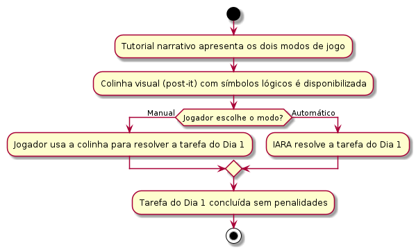</p>

**Critérios cobertos:** Dia 1 jogável do início ao fim sem penalidades · colinha visual (¬, ∧, ∨, →, ↔) acessível nos dois modos · jogador entende a diferença entre os modos ao final.
*Fonte editável: [US06-tutorial-dia1-colinha.md](US06-tutorial-dia1-colinha.md)*

<br>

<a id="us07"></a>
### US07: Lógica ensinada pela narrativa

> Como Lívia, quero aprender os conceitos de lógica resolvendo as tarefas do protagonista dentro da história, sem telas de teoria separadas, para não sentir que estou fazendo uma aula disfarçada de jogo.

<p align="center">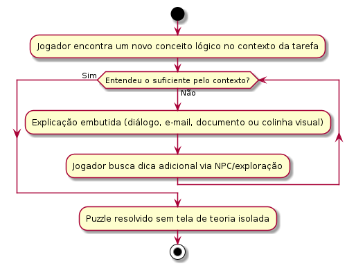</p>

**Critérios cobertos:** nenhum puzzle precedido de tela de teoria separada · jogador consegue entender o suficiente pelo contexto da tarefa.
*Fonte editável: [US07-logica-narrativa.md](US07-logica-narrativa.md)*

<br>

<a id="us09"></a>
### US09: Revisão de correção lógica

> Como Wagner, quero ter confiança de que cada puzzle está logicamente correto e alinhado ao conteúdo da disciplina, para poder recomendar o jogo em sala de aula sem medo de ensinar algo errado.

<p align="center">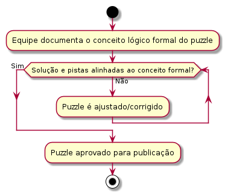</p>

**Critérios cobertos:** conceito lógico formal documentado internamente · conferência pelo material da disciplina antes de finalizar · nenhum puzzle publicado sem revisão.
*Fonte editável: [US09-revisao-correcao-logica.md](US09-revisao-correcao-logica.md)*

<br>

<a id="us09b"></a>
### US09b: Testes automatizados por tarefa

> Como Wagner, quero que cada tarefa tenha verificação automática do resultado, para ter uma garantia técnica adicional de que o jogo se comporta como esperado antes de levar pra sala de aula.

<p align="center">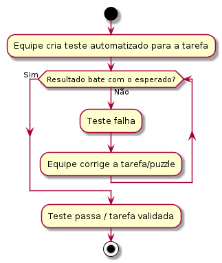</p>

**Critérios cobertos:** cada puzzle tem ao menos um teste associado · teste falha se o resultado não bater com o esperado · testes rodam antes de cada versão ser considerada pronta.
*Fonte editável: [US09b-testes-automatizados.md](US09b-testes-automatizados.md)*

<br>

<a id="us10"></a>
### US10: Feedback visual, sem HUD numérico

> Como Lívia, quero perceber o estado do jogo por sintomas visuais e narrativos como mudanças de cenário, em vez de números na tela, para viver a tensão da história sem ficar calculando estatísticas.

<p align="center">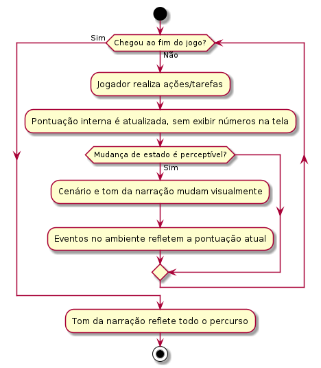</p>

**Critérios cobertos:** nenhum número de status visível · tom da narração muda perceptivelmente do início ao fim · eventos do ambiente seguem a pontuação atual.
*Fonte editável: [US10-sintomas-visuais-hud.md](US10-sintomas-visuais-hud.md)*

<br>

<a id="us11"></a>
### US11: Pontuação varia por método

> Como Lívia, quero que a forma como resolvo cada tarefa influencie no meu resultado final que recebo, para sentir que minhas escolhas ao longo do jogo realmente importam.

<p align="center">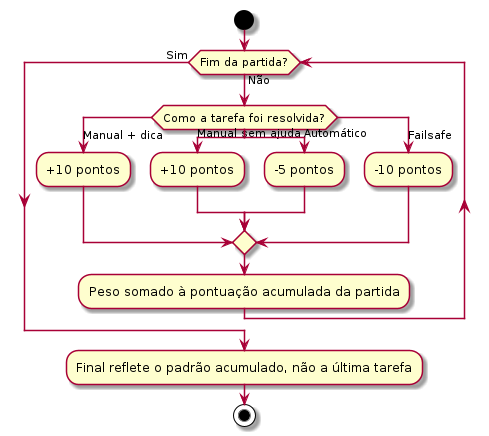</p>

**Critérios cobertos:** pesos diferentes por método (manual = manual+dica > automático) · valores 10 / -5 / -10 · peso acumulado ao longo da partida · final reflete o padrão geral.
*Fonte editável: [US11-pontuacao-por-metodo.md](US11-pontuacao-por-metodo.md)*

<br>

<a id="us12"></a>
### US12: Múltiplos finais por escolhas

> Como Matheus, quero que o jogo tenha múltiplos finais determinados pelas minhas escolhas, e não por sorte, para poder mostrar pro público que cada decisão teve peso real na história.

<p align="center">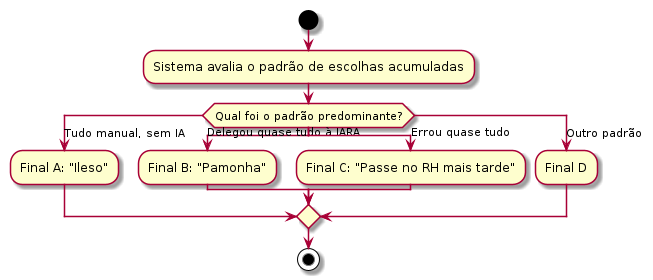</p>

**Critérios cobertos:** pelo menos 4 finais distintos · final depende do padrão de escolhas · mesmo padrão repetido leva ao mesmo final (sem aleatoriedade).
*Fonte editável: [US12-multiplos-finais.md](US12-multiplos-finais.md)*

<br>

<a id="us13"></a>
### US13: Tensão progressiva, sem jump scare

> Como Matheus, quero que a tensão do jogo cresça progressivamente, de estranhezas sutis até o confronto final, sem depender de jump scares como recurso principal, para manter minha live num tom de suspense sustentado em vez de sustos pontuais.

<p align="center">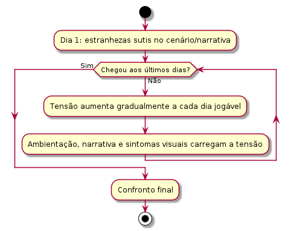</p>

**Critérios cobertos:** progressão de tom descritível do mais sutil ao mais intenso · jump scares, quando existirem, não são o principal recurso de tensão.
*Fonte editável: [US13-tensao-progressiva.md](US13-tensao-progressiva.md)*

<br>

<a id="us14"></a>
### US14: Interação opcional com NPCs

> Como Lívia, quero poder interagir/conversar com NPCs, para ter uma alternativa que não seja só resolver puzzle sozinha.

<p align="center">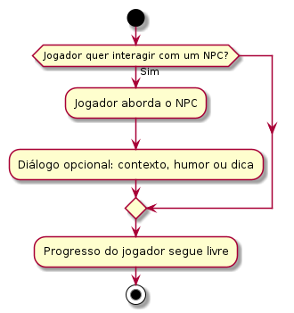</p>

**Critérios cobertos:** NPCs alcançáveis por escolha do jogador · pelo menos 1 interação de diálogo disponível · interação opcional, não bloqueia o progresso.
*Fonte editável: [US14-interacao-npcs.md](US14-interacao-npcs.md)*

---


## Manutenção

Os diagramas são escritos em [PlantUML](https://plantuml.com/activity-diagram-beta) e renderizados em PNG com a ferramenta oficial `plantuml`. Para alterar um fluxo:

1. Edite o bloco ` ```plantuml ` (entre `@startuml` e `@enduml`) no arquivo `US*.md` correspondente.
2. Gere a imagem novamente, apontando a saída para a pasta `imagens/`:
   ```bash
   plantuml -tpng -o imagens US01-save-automatico.md
   ```
   O PlantUML localiza o bloco `@startuml`/`@enduml` automaticamente, mesmo dentro de um arquivo `.md`.
3. O arquivo gerado já sai com o nome `US01-save-automatico.png` dentro de `imagens/` — o README aponta para esse caminho, então a atualização aparece sozinha.

Se preferir não instalar nada localmente, o [editor online oficial](https://plantuml.com/activity-diagram-beta) permite colar o código de qualquer história e exportar o PNG manualmente.
