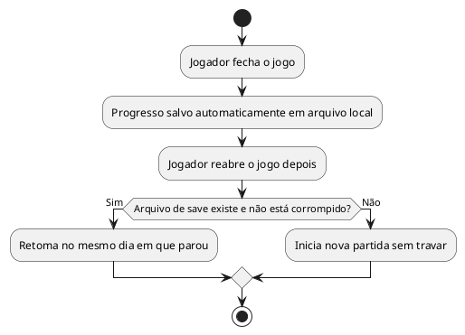

# US01: Save automático ao fechar

**User Story:** Como Lívia, quero que meu progresso salve automaticamente ao fechar o jogo, para retomar de onde parei nas minhas horas vagas curtas.

## Diagrama de atividades

**Critérios cobertos:** retomada no mesmo dia; sem conta/internet; salvo em arquivo local; save ausente ou corrompido não trava o jogo.
