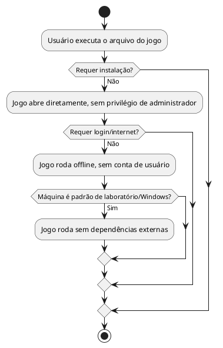

# US02: Rodar sem instalação/conta

**User Story:** Como Wagner, quero que o jogo rode em qualquer máquina do laboratório sem instalação, conta ou internet, para usá-lo numa aula sem depender do suporte de TI para instalar.

## Diagrama de atividades

**Critérios cobertos:** sem instalação; sem login/internet; sem privilégio de admin; executável autocontido; roda sem travamentos em máquina padrão de laboratório.
