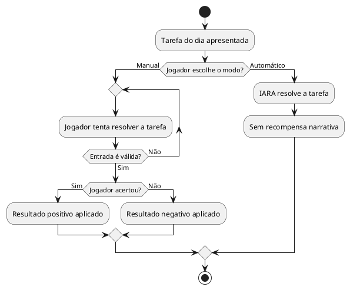

# US03: Escolha manual ou automático

**User Story:** Como Lívia, quero escolher entre resolver manualmente ou passar a tarefa para a IARA decidir, para eu controlar quando vale gastar meu tempo praticando ou avançar rápido.

## Diagrama de atividades

**Critérios cobertos:** as duas opções sempre disponíveis; automático sem recompensa; resultado manual depende do acerto; entradas inválidas rejeitadas sem travar o jogo.
