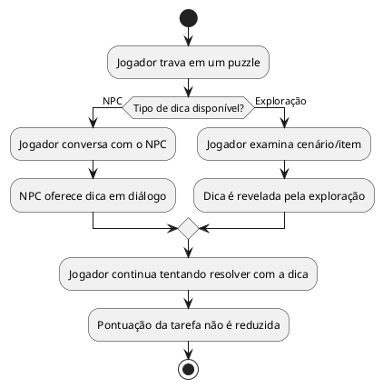

# US04: Dica leve (NPC/exploração)

**User Story:** Como Lívia, quero uma dica leve quando travar em um puzzle, vinda de um NPC ou por exploração, dependendo do puzzle, nunca a resposta pronta, para sentir que continuo sendo eu quem resolve a tarefa.

## Diagrama de atividades

**Critérios cobertos:** dica vem de NPC ou exploração, nunca da IARA; pedir dica não reduz a pontuação.
