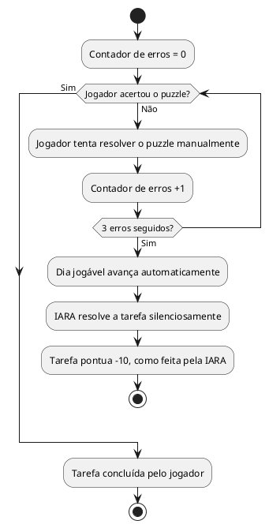

# US04b: Failsafe após 3 erros

**User Story:** Como Lívia, quero que o jogo sempre me deixe avançar mesmo se eu não conseguir resolver um puzzle, para não ficar travada sem conseguir continuar a história.

## Diagrama de atividades

**Critérios cobertos:** 3 erros seguidos avançam o dia automaticamente; tarefa pontua como feita pela IARA; jogador nunca fica bloqueado.
