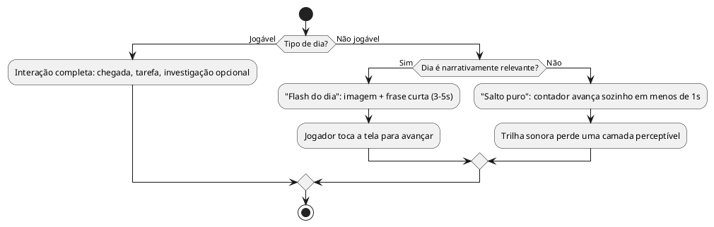

# US05: Duração da tarefa / Flash do dia e salto puro

**User Story:** Como Matheus, quero que os dias sem tarefa jogável sejam resolvidos por uma tela rápida (Flash do dia) ou por um salto automático no calendário (salto puro), para que os 100 dias da história caibam numa sessão de 15–20 minutos sem quebrar o ritmo da minha live.

## Diagrama de atividades

**Critérios cobertos:** os 9 dias jogáveis mantêm interação completa; "Flash do dia" com imagem+frase avança só com toque; "salto puro" avança sozinho em <1s; trilha sonora perde camada a cada bloco de salto puro.
