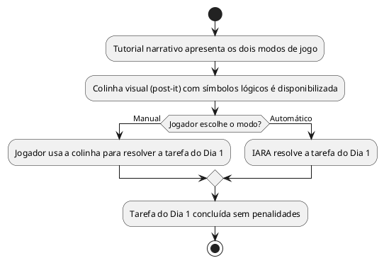

# US06: Tutorial Dia 1 + colinha visual

**User Story:** Como Lívia, quero um tutorial de integração claro no Dia 1 que apresente os símbolos lógicos básicos e como funcionam os dois modos de jogo, para entender Manual e Automático antes de puzzles mais difíceis.

## Diagrama de atividades

**Critérios cobertos:** Dia 1 jogável do início ao fim sem penalidades; colinha visual (¬, ∧, ∨, →, ↔) acessível nos dois modos; jogador entende a diferença entre os modos ao final.
