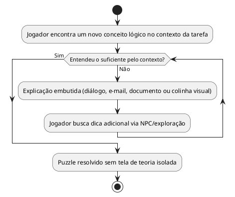

# US07: Lógica ensinada pela narrativa

**User Story:** Como Lívia, quero aprender os conceitos de lógica resolvendo as tarefas do protagonista dentro da história, sem telas de teoria separadas, para não sentir que estou fazendo uma aula disfarçada de jogo.

## Diagrama de atividades

**Critérios cobertos:** nenhum puzzle precedido de tela de teoria separada; jogador consegue entender o suficiente pelo contexto da tarefa.
