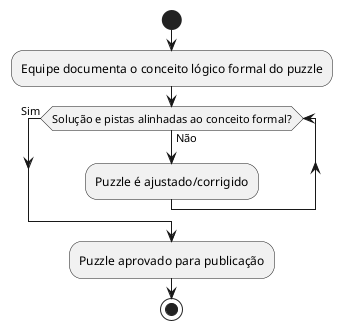

# US09: Revisão de correção lógica

**User Story:** Como Wagner, quero ter confiança de que cada puzzle está logicamente correto e alinhado ao conteúdo da disciplina, para poder recomendar o jogo em sala de aula sem medo de ensinar algo errado.

## Diagrama de atividades

**Critérios cobertos:** conceito lógico formal documentado internamente; conferência pelo material da disciplina antes de finalizar; nenhum puzzle publicado sem revisão.
