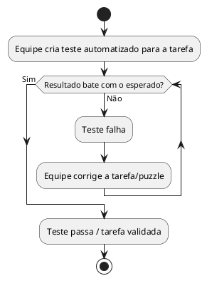

# US09b: Testes automatizados por tarefa

**User Story:** Como Wagner, quero que cada tarefa tenha verificação automática do resultado, para ter uma garantia técnica adicional de que o jogo se comporta como esperado antes de levar pra sala de aula.

## Diagrama de atividades

**Critérios cobertos:** cada puzzle tem ao menos um teste associado; teste falha se o resultado não bater com o esperado; testes rodam antes de cada versão ser considerada pronta.
