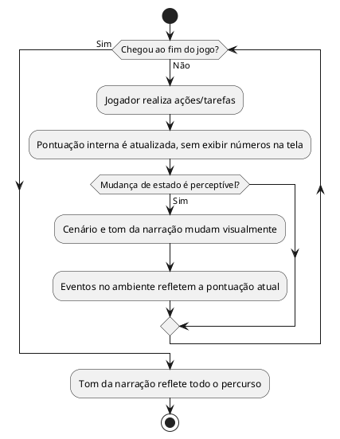

# US10: Feedback visual, sem HUD numérico

**User Story:** Como Lívia, quero perceber o estado do jogo por sintomas visuais e narrativos como mudanças de cenário, em vez de números na tela, para viver a tensão da história sem ficar calculando estatísticas.

## Diagrama de atividades

**Critérios cobertos:** nenhum número de status visível; tom da narração muda perceptivelmente do início ao fim; eventos do ambiente seguem a pontuação atual.
