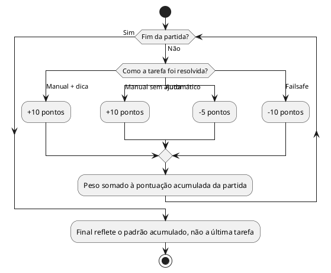

# US11: Pontuação varia por método

**User Story:** Como Lívia, quero que a forma como resolvo cada tarefa influencie no meu resultado final que recebo, para sentir que minhas escolhas ao longo do jogo realmente importam.

## Diagrama de atividades

**Critérios cobertos:** pesos diferentes por método (manual = manual+dica > automático); valores 10/-5/-10; peso acumulado ao longo da partida; final reflete o padrão geral.
