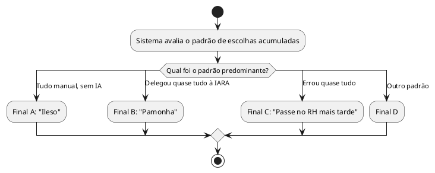

# US12: Múltiplos finais por escolhas

**User Story:** Como Matheus, quero que o jogo tenha múltiplos finais determinados pelas minhas escolhas, e não por sorte, para poder mostrar pro público que cada decisão teve peso real na história.

## Diagrama de atividades

**Critérios cobertos:** pelo menos 4 finais distintos; final depende do padrão de escolhas; mesmo padrão repetido leva ao mesmo final (sem aleatoriedade).
