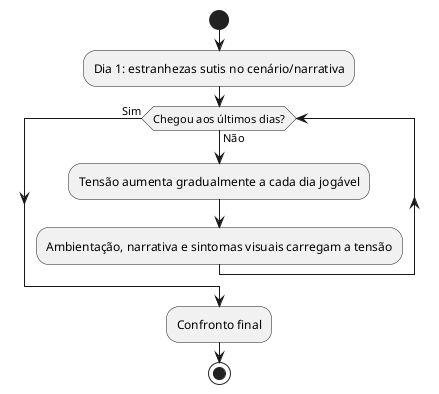

# US13: Tensão progressiva, sem jump scare

**User Story:** Como Matheus, quero que a tensão do jogo cresça progressivamente, de estranhezas sutis até o confronto final, sem depender de jump scares como recurso principal, para manter minha live num tom de suspense sustentado em vez de sustos pontuais.

## Diagrama de atividades

**Critérios cobertos:** progressão de tom descritível do mais sutil ao mais intenso; jump scares, quando existirem, não são o principal recurso de tensão.
