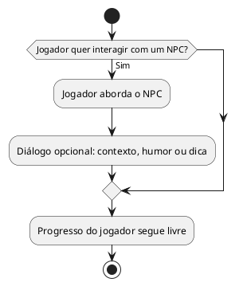

# US14: Interação opcional com NPCs

**User Story:** Como Lívia, quero poder interagir/conversar com NPCs, para ter uma alternativa que não seja só resolver puzzle sozinha.

## Diagrama de atividades

**Critérios cobertos:** NPCs alcançáveis por escolha do jogador; pelo menos 1 interação de diálogo disponível; interação opcional, não bloqueia o progresso.
