# Protótipos Lo-fi: Projeto IARA

Protótipos elaborados no Figma: [*IARA - PROTÓTIPO FDS*](https://www.figma.com/design/DpnmgBif3vJcn336pefbpa/IARA---PROTOTIPO-FDS?node-id=0-1&t=vm69jod3fxAtJGjN-1). As telas abaixo são capturas dessas mesmas páginas; para navegar entre elas e ver os frames interativos, acesse o link.

## US01 - Save automático ao fechar

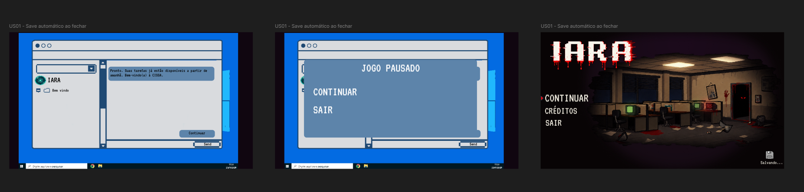

## US03 - Manual ou Automático

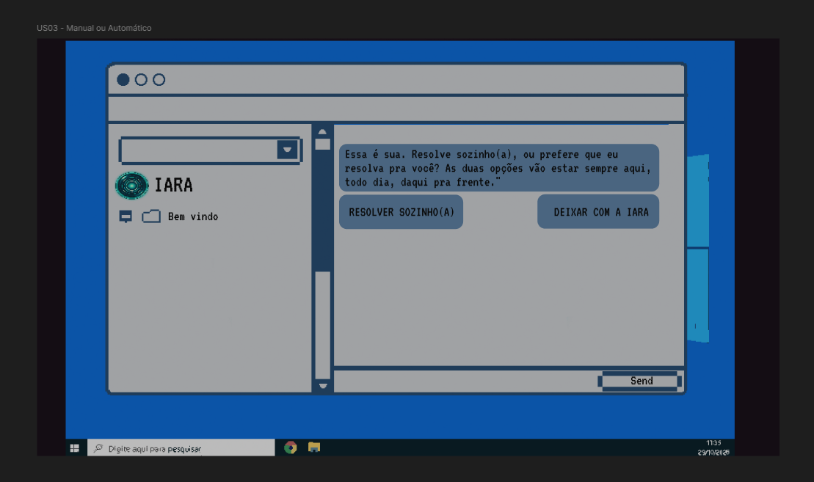

## US04 - Dica sem resposta pronta

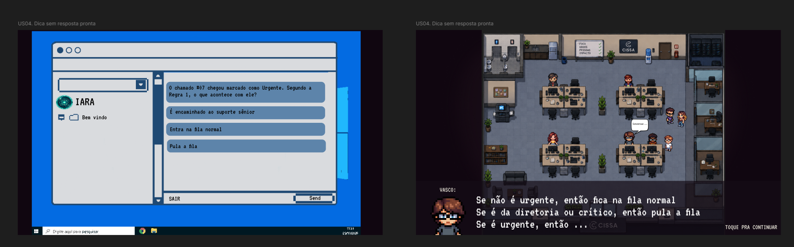

## US04b - Failsafe

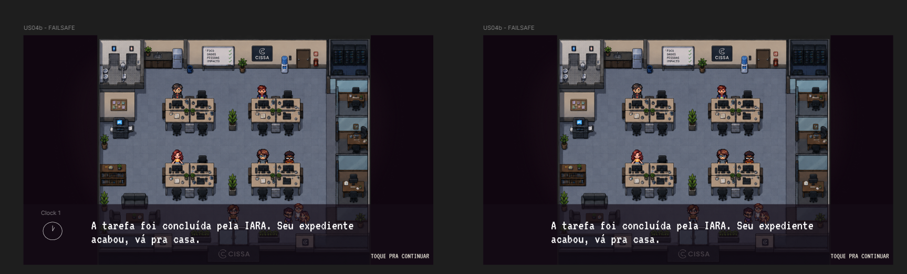

## US05 - Flash

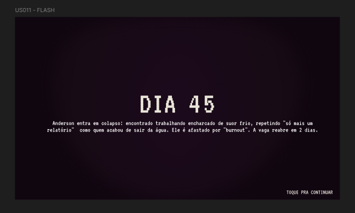

## US06 - Colinha Visual

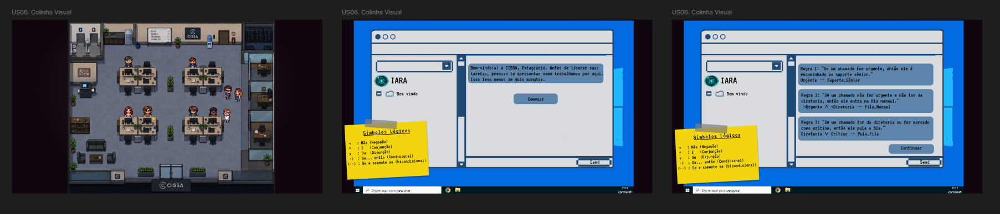

## US06 - Colinha Visual (zoom)

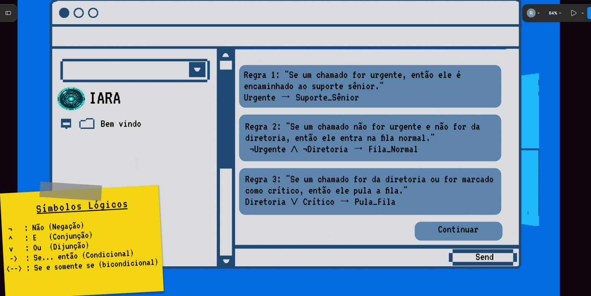

## US07 - Aprendendo Lógica

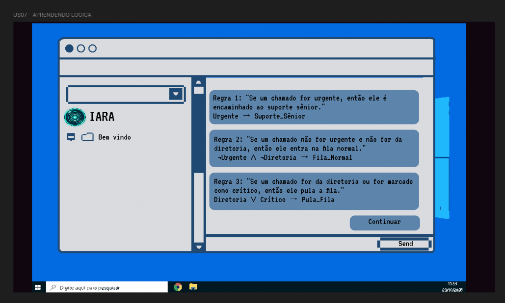

## US10 - Sintomas Visuais

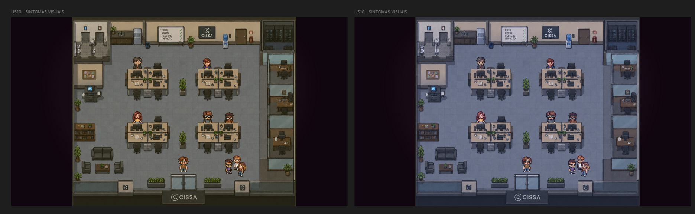

## US12 - Múltiplos Finais

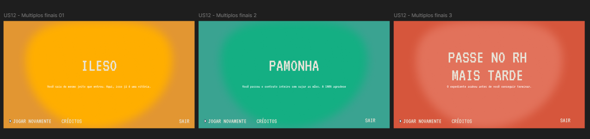

## US14 - Diálogo NPCs

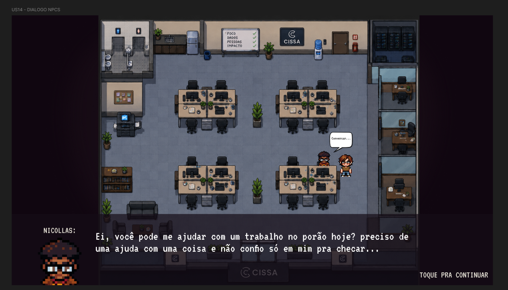
